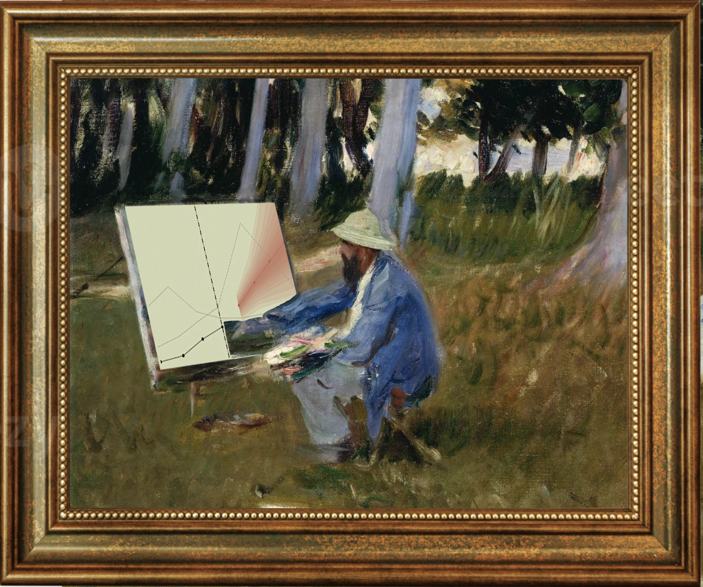
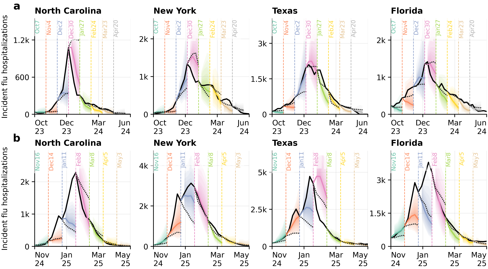
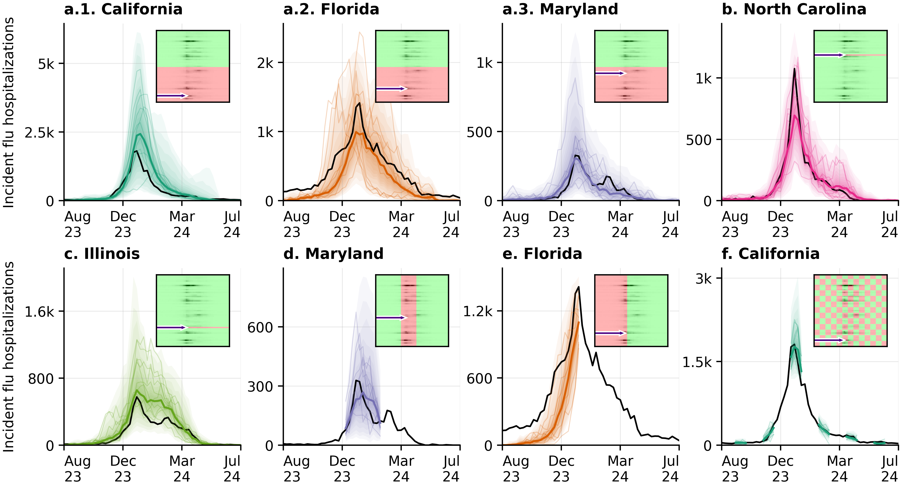
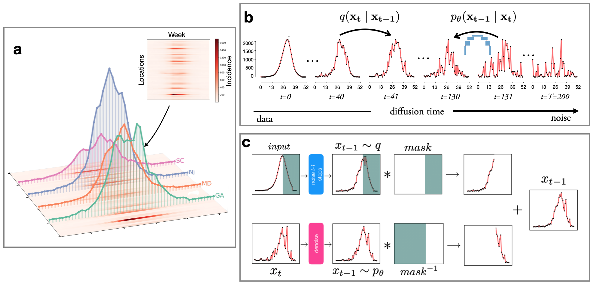

# Influpaint: generative diffusion models for spatiotemporal influenza forecasting

  
Joseph Lemaitre and Justin Lessler

  <small>Atlantic Coast Center for Infectious Disease Dynamics and Analytics (ACCIDDA) at UNC Chapel Hill</small>

## Abstract

<figure class="monet-inpainting">
  
  <figcaption>
    <em>Claude Monet peignant la grippe en Caroline du Nord</em> 
    John Singer Sargent, 1885, Tate Britain
  </figcaption>
</figure>

Forecasting infectious disease incidence can provide important information to guide public health planning, yet is difficult because epidemic dynamics are complex. Current mechanistic and statistical approaches often struggle to capture multimodal uncertainty or emergent trends. Influpaint adapts denoising diffusion probabilistic models to epidemic forecasting. By encoding influenza seasons as spatiotemporal images in which pixel intensity represents incidence, influpaint learns a rich distribution of disease dynamics from a hybrid dataset of surveillance and simulated trajectories. Forecasting is formulated as a conditional generation (inpainting) task from partial observations. We show that influpaint generates realistic, diverse epidemic trajectories and achieves forecast accuracy that is competitive with leading ensemble methods in retrospective evaluation. In real-time evaluation during the 2023–2025 U.S. CDC FluSight challenges, performance improved substantially across seasons, with highly accurate but somewhat overconfident projections in 2024–2025. The best performance was achieved with a training dataset containing 30% surveillance and 70% simulated trajectories. These results show that diffusion models can capture important spatiotemporal structure in influenza dynamics and provide a flexible framework for probabilistic infectious disease forecasting.

[Read the paper on arXiv: *Generative diffusion models for spatiotemporal influenza forecasting*](https://arxiv.org/abs/2604.24913){ .md-button .md-button--primary }

## Explore the walkthrough

Follow the walkthrough to prepare influenza data, train models, and make forecasts. Start by gathering surveillance and simulated seasons, turn them into training images with different source mixtures, and train candidate diffusion models. Then condition each model on observed hospitalizations, compare its forecasts, and use the selected formulation for reconstruction or weekly forecasting.

[Start the step-by-step walkthrough](workflows/start-here.md){ .md-button .md-button--primary }
[Install the environment](getting-started/installation.md){ .md-button .md-button--primary }

!!! tip "Paper reproducibility"

    [Jump here to reproduce the paper](workflows/paper-figures.md) using saved data, forecasts, and scores from the Zenodo reproducibility archive.

    **Zenodo DOI: [10.5281/zenodo.22699980](https://doi.org/10.5281/zenodo.22699980).**

## Forecast influenza hospitalizations

**Figure 2 — Forecasts from observed history.** Influpaint conditions on the observed part of a season to generate 512 possible trajectories for future hospitalizations. Colored fans show forecast uncertainty and colored lines show medians for North Carolina, New York, Texas, and Florida across the 2023–2024 and 2024–2025 seasons. Black lines show observed hospitalizations, dotted lines show the FluSight ensemble, and dashed vertical lines mark the last observed week for each forecast. These retrospective forecasts use finalized observations up to each forecast date.

## Adapt to different observation patterns without retraining

**Figure 4 — One trained model, many reconstruction tasks.** Influpaint can adapt to different patterns of missing data by changing the observation mask at sampling time, without retraining the model. The same model reconstructs missing states, fills midseason gaps, infers early-season dynamics from later observations, and handles checkerboard patterns of missing weeks and locations. Black curves show observed hospitalizations; colored fans and lines show predictive quantiles and medians. The insets identify observed entries in green and hidden entries in red. This flexibility lets the model work with partial spatial coverage and interrupted time series.

## How influpaint works

**Figure 5 — Model overview.** **a.** An influenza season becomes an image whose axes represent weeks and locations and whose pixel intensity represents incidence. **b.** A diffusion model learns to reverse the gradual addition of noise, allowing it to generate new, plausible seasons. **c.** Inpainting combines observed values and a mask with the generation process to infer the missing parts of a season. The paper's forecasting implementation uses CoPaint to condition these generated trajectories on the available observations.

## Funding

This work was supported by the National Institutes of Health (NIH, award *5R01AI102939*). This project was made possible by cooperative agreement CDC-RFA-FT-23-0069 from the CDC's Center for Forecasting and Outbreak Analytics. Its contents are solely the responsibility of the authors and do not necessarily represent the official views of the Centers for Disease Control and Prevention.
