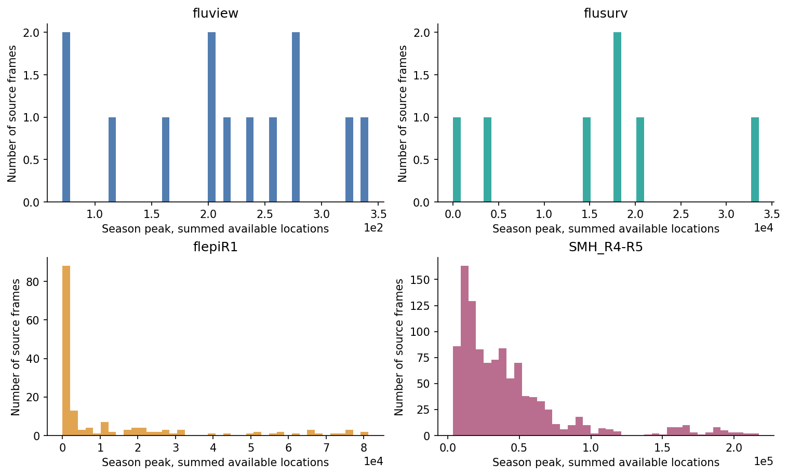
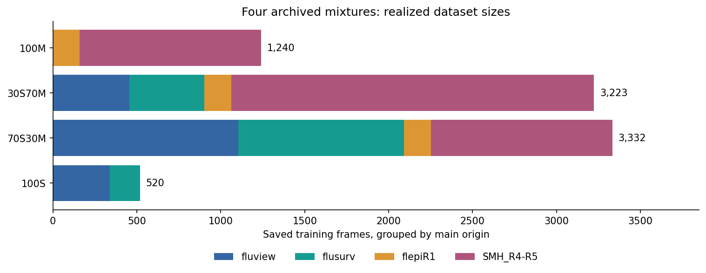
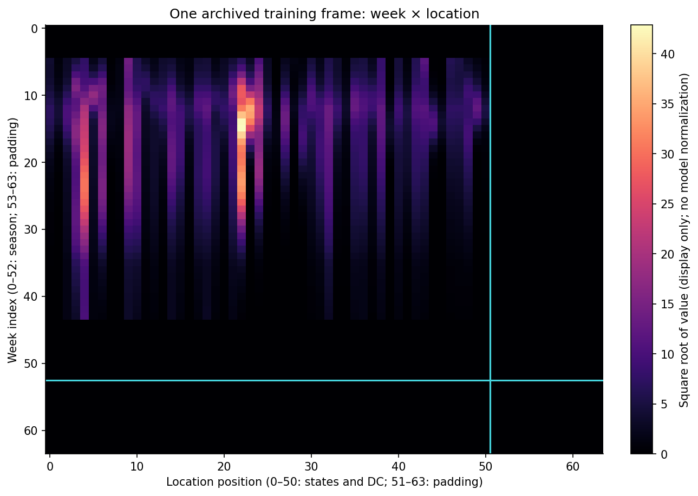
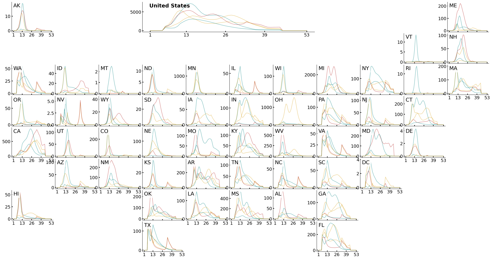

# 2. Create training data

You will use **`dataset_Creation/2-build_training_flu_datasets_ipynb.py`** and the combined Parquet table to create **four NetCDF datasets of complete season images** for training.

!!! tip "Skip this step with the reproduction archive"

    Use the exact paper inputs in `influpaint-paper/influpaint_paper_reproduction_data/datasets/training/`:
    
    ```bash
    mkdir -p training_datasets
    cp influpaint-paper/influpaint_paper_reproduction_data/datasets/training/TS_*_2025-07-17.nc training_datasets/
    ```
    
    The files are `TS_100S_2025-07-17.nc`, `TS_70S30M_2025-07-17.nc`, `TS_30S70M_2025-07-17.nc`, and `TS_100M_2025-07-17.nc`. The batch configuration selects these dates explicitly.


Open the Jupytext script as notebook cells and use the repository root as the working directory. Read `Flusight/flu-datasets/all_datasets.parquet` first. A fresh notebook execution writes filenames with today's date and performs randomized mixing; it will not reproduce the archived realization exactly.

## Scene 1 — Compare source scales

The notebook sums available locations for each `(datasetH1, datasetH2, fluseason, sample, season_week)` and takes the peak across weeks. This exposes differences in source magnitude before mixing.



*The notebook's peak calculation rendered from the archived Parquet table. Each histogram uses its own scale. Summed available locations do not necessarily provide equal geographic coverage across sources.*

FluView frames use `to_scale=True`. The mixer draws target peak magnitudes from the `SMH_R4-R5` peak distribution to rescale those frames while retaining their epidemic shapes.

## Scene 2 — Mix and complete season frames

`influpaint/datasets/mixer.py` builds frames with weeks 1–53 and all 51 states/DC. The notebook requests `fill_missing_locations="random"` and preserves source provenance in `origin`. It then uses `influpaint/utils/converters.py` to arrange frames into arrays.

| Mixture | Notebook recipe | Saved samples |
| --- | --- | ---: |
| `100S` | FluView and FluSurv, each with multiplier 26 | 520 |
| `70S30M` | 37% FluView, 33% FluSurv, 5% flepiMoP, 25% SMH | 3,332 |
| `30S70M` | 15% FluView, 15% FluSurv, 5% flepiMoP, 65% SMH | 3,223 |
| `100M` | flepiMoP and SMH, each with multiplier 1 | 1,240 |



*Counts read from the exact July 17 NetCDF files, grouped by each frame's `main_origins` attribute. Main origin summarizes frame provenance; filled locations can have different origins. The percentages are mixing targets, not guarantees of exact realized proportions. A requested size of 3,000 differs from the realized sample count and from 3,000 training epochs.*

## Scene 3 — See the season as an image

The saved dimensions are `(sample, feature, season_week, place)`, with shape `(N, 1, 64, 64)`. The first 53 week positions and 51 location positions contain the season; the remaining rows and columns are padding. There is one incidence channel. State order comes from `SeasonAxis`, not alphabetical state names.



*Sample 3000 from the archived `30S70M` dataset. Cyan lines delimit padding. A square root makes the display readable; the model's full normalization is applied later by the training loader.*

## Scene 4 — Return to epidemic curves for a sanity check



*The notebook's final `plot_us_grid` call, using samples 3000–3004 from the saved `30S70M` file. The geographic arrangement makes state trajectories readable; the model itself sees the fixed location-column order above.*

Each NetCDF file stores `main_origins` and `mix_cfg` attributes alongside the values and coordinates. Training reconstructs scaling from its selected dataset, so preserve the dataset together with the checkpoint. Regenerate these story images using `python -m main_training.render_notebook_stories`.

[Previous: 1. Gather source datasets](compiling-data-sources.md) · [Next: 3. Train candidate models](training.md)
