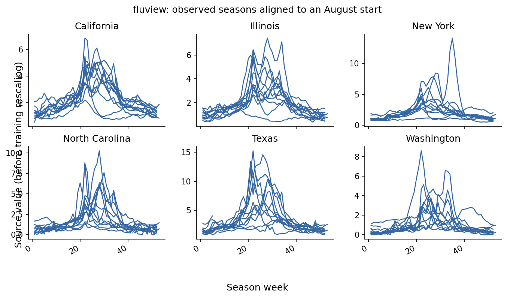
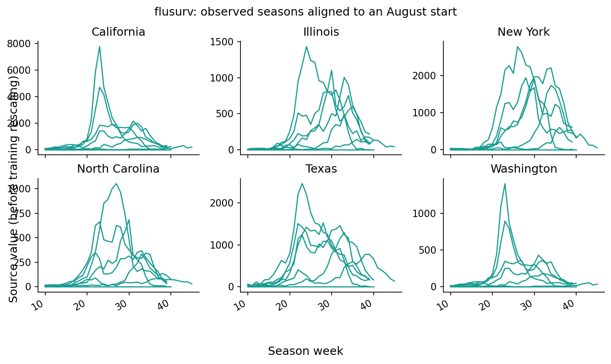
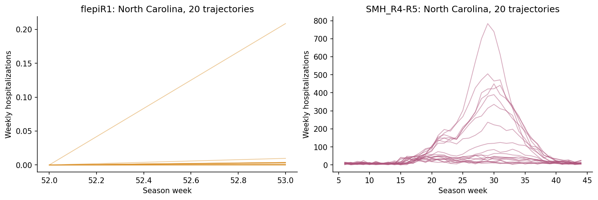

# 1. Gather source datasets

You will use **`dataset_creation/1-gather_all_flu_datasets_ipynb.py`** to turn surveillance records and simulated influenza trajectories into **`Flusight/flu-datasets/all_datasets.parquet`**, a common table that the training-data notebook can mix.

!!! tip "Skip this step with the reproduction archive"

    Use `influpaint-paper/influpaint_paper_reproduction_data/datasets/sources/all_datasets.parquet`. Restore it to the notebook input path:
    
    ```bash
    mkdir -p Flusight/flu-datasets
    cp influpaint-paper/influpaint_paper_reproduction_data/datasets/sources/all_datasets.parquet Flusight/flu-datasets/all_datasets.parquet
    ```
    
    This is the locally available gathered-data snapshot, last modified November 7, 2025. It is not established as the original input to the July 17 training datasets. For the exact saved training realization, skip directly to the NetCDF files in step 2.


## Open the first notebook

The source file uses Jupytext's `# %%` cell format. Open it as a notebook in your editor, or create an unexecuted Jupyter copy:

```bash
jupytext --to notebook dataset_creation/1-gather_all_flu_datasets_ipynb.py --output dataset_creation/1-gather_all_flu_datasets.ipynb
```

Run cells from the repository root. The notebook defaults to `download=False`, using the cached upstream files. Its source-reader code is in `influpaint/datasets/read_datasources.py`. Follow the notebook's source-preparation cells if assembling the raw inputs; the Parquet shortcut avoids that download and preparation work.

## Scene 1 — Put surveillance seasons on the same calendar

FluView describes influenza-like illness; FluSurv supplies hospitalization information. They capture epidemic shapes on different scales. `SeasonAxis.for_flusight(remove_us=True, remove_territories=True)` gives them a shared August-start season calendar and state/DC location codes.



*The first notebook's `plot_season_overlap_grid` view, rendered from the archived standardized FluView rows for six states. Each line is a season. Values retain the source scale; these are not yet hospitalization-scale training images.*



*The same view for `csp_flusurv`, the hospitalization series included in the combined training-source table. The notebook also inspects Delphi FluSurv, but its final concatenation uses the CSP-prepared series.*

## Scene 2 — Add plausible seasons from transmission models

The notebook reads Flu Scenario Modeling Hub rounds 4–5 and flepiMoP round 1. It excludes PSI-M2, samples 20 trajectories per SMH model/scenario, and selects 80 flepiMoP sample IDs. These sampling operations produce a particular realization each time the notebook runs.



*Twenty source trajectories per family, selected in sorted identifier order from the archive. This additional view makes the notebook's modeling-source step visible; the values are saved data, not newly simulated trajectories.*

## Scene 3 — Save a common table

| Columns | Meaning |
| --- | --- |
| `datasetH1`, `datasetH2` | Source family and source/model/scenario identifier |
| `fluseason`, `sample` | Season and trajectory identifier |
| `location_code`, `season_week` | Where and when the value belongs |
| `value`, `week_enddate` | Source measurement and calendar date |

The four included families are `fluview`, `flusurv`, `flepiR1`, and `SMH_R4-R5`. The archived table contains 2,535,111 rows. This is still a long table with varying source coverage; step 2 constructs complete image frames.

The NHSN cells separately prepare observed hospitalizations at `influpaint/data/nhsn_flusight_past.csv`. NHSN is used for history and evaluation, outside the four training-source families. Its saved copy is `influpaint-paper/influpaint_paper_reproduction_data/observations/nhsn_flusight_past.csv`.

Run the standard cells through the Parquet save. The notebook's intentional `assert False` marks the boundary before optional custom-data experiments.

The story images are regenerated with `python -m main_training.render_notebook_stories`. They visualize the archived data without rerunning downloads or random source sampling.

[Previous: Start here](start-here.md) · [Next: 2. Create training data](build-training-datasets.md)
