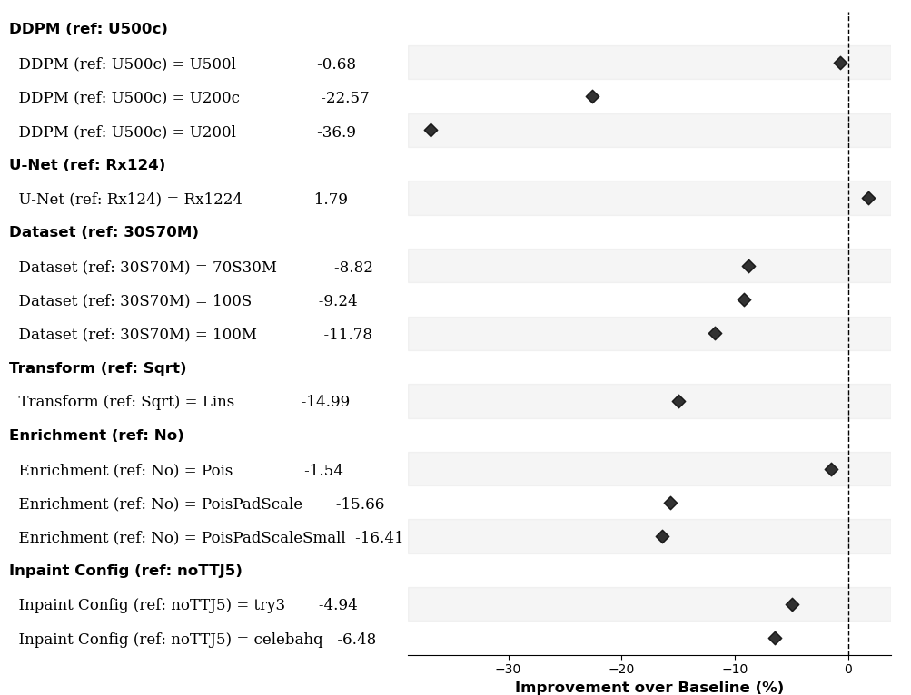
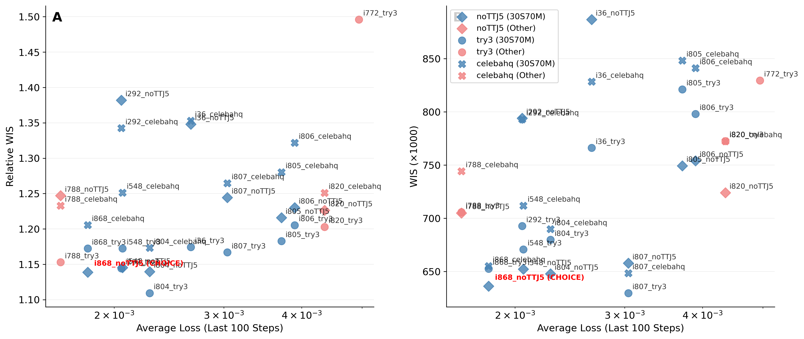

# 6. Score forecasts and select the formulation

Score the forecasts from step 5 and choose which model and conditioning settings to use. Compare each candidate's predictive distributions with observed hospitalizations on the same dates, locations, and horizons, and include benchmark forecasts to put its accuracy in context.

The evaluation pipeline joins the forecast CSVs to truth, computes probabilistic scores with R's `scoringutils`, and aggregates those scores into a leaderboard. A formulation here includes both the trained-model scenario and the CoPaint setting: the same checkpoint can forecast differently under different conditioning configurations.

!!! tip "Use saved results from the Zenodo archive"

    Get the [Zenodo reproducibility archive](start-here.md#reproducibility-archive) to use these saved files.

    Use `influpaint-paper/influpaint_paper_reproduction_data/analysis/scoringutils_scores.csv` for the saved per-forecast scores, and `influpaint-paper/influpaint_paper_reproduction_data/analysis/leaderboard_full.csv` for the saved rankings. The selected-model forecast archive does not contain all candidate forecast CSVs required to rescore the complete comparison. To remake the paper comparison figures directly, use step 8.

## 1. Choose the forecasts and join them to observations

Each forecast must be matched to the hospitalization count for its target week and location. A forecast issued on March 15 for March 22 is compared with the March 22 observation, not the March 15 observation. The preparation script makes that join and keeps the model, reference date, season, and horizon as identifiers.

Before running `evaluation/prepare_dataset_for_scoringutils.py`, set these inputs for your experiment:

| Setting | What to set |
| --- | --- |
| `Config.JOBS_FILE` | The manifest generated in step 4; it supplies the dates and CoPaint configurations to evaluate |
| `Config.INPAINT_RES_BASE` | The directory containing the forecast experiment folders produced in step 5 |
| `batch_prefix` in `find_influpaint_csvs()` | The start of the experiment folder names to include; it currently selects `07b44fa_paper-2025-07-22_inpainting_` |
| `Config.FLUSIGHT_BASES` | The hub checkout for each season; each checkout must contain `model-output/` and `target-data/target-hospital-admissions.csv` |
| `Config.TARGET_NAME` | `wk inc flu hosp`, weekly incident influenza hospitalizations |
| `Config.HORIZONS` | `[0, 1, 2, 3]`, the four target weeks used in the paper comparison |

For example, if step 5 wrote to `forecast_output/abc1234_my-flu-experiment_inpainting_2026-09-11/`, set `INPAINT_RES_BASE` to `forecast_output` and `batch_prefix` to `abc1234_my-flu-experiment_inpainting_`. Replace the example revision with the prefix of your actual folder. Updating the base directory alone will leave the paper-specific prefix filter in place.

The script reads candidate CSVs and official FluSight submissions, keeps quantile forecasts for the requested target and horizons, and checks for the 23 quantile probabilities listed in [step 5](inpainting.md#read-a-forecast-csv). It prints how many forecast dates were found for each model. Missing forecast files and files without the required probabilities are skipped; inspect these counts before interpreting a comparison.

Run from the research repository root after copying the cluster outputs:

```bash
python -m evaluation.prepare_dataset_for_scoringutils
```

The output is `results/combined_forecast_truth_data.csv`. It has one row per quantile for a model, reference date, target week, location, and horizon. `predicted` is the forecast quantile value, `quantile` is its probability, and `observed` is the matching hospitalization count. The same observed count is repeated across the 23 quantile rows for a forecast. `group` distinguishes InfluPaint candidates (`influpaint`) from official hub submissions (`flusight`). The script joins by location and target date and stops if that join loses forecast rows.

## 2. Calculate and interpret the scores

R requires `scoringutils` and `dplyr`. Run:

```bash
Rscript evaluation/score_with_scoringutils.R results/combined_forecast_truth_data.csv results/scoringutils_scores.csv
```

The R script groups the quantile rows into forecast distributions. It writes one score row for each unique combination of model, group, season, reference date, target date, location, and horizon. These columns describe the forecast; the remaining columns describe its performance:

| Score column | What it measures | How to read it |
| --- | --- | --- |
| `wis` | Weighted interval score: predictive interval width plus penalties when observations fall outside the intervals | Lower is better; narrow intervals help only when they remain accurate |
| `dispersion` | The interval-width component of WIS | Larger values indicate wider predictive intervals |
| `overprediction` | WIS penalty for predictive intervals that lie too high | Larger values indicate more error from predicting too many hospitalizations |
| `underprediction` | WIS penalty for predictive intervals that lie too low | Larger values indicate more error from predicting too few hospitalizations |
| `interval_coverage_50`, `interval_coverage_90` | Whether the observation falls inside the central 50% or 90% interval | Each row is true/false; averaging gives the fraction of forecasts that covered the observation |
| `ae_median` | Absolute difference between the predicted median and the observation | Error of the central prediction, in hospitalization units |
| `bias` | Signed tendency to place the observation above or below the forecast distribution | Positive indicates overprediction; negative indicates underprediction |

For example, if 70 of 100 observations fall inside the forecast's central 90% interval, its empirical 90% coverage is 70%. The intervals missed observations more often than their nominal coverage suggests. Read coverage alongside WIS: simply widening every interval can improve coverage while increasing the dispersion penalty.

## 3. Build the leaderboard

```bash
python -m evaluation.plot_evaluation_results
```

This reads `results/scoringutils_scores.csv`, writes diagnostic plots under `results/simple_plots/`, and writes `results/leaderboards/leaderboard_full.csv`. To plot a different score file in a separate folder, use:

```bash
python -m evaluation.plot_evaluation_results \
  --csv-path results/my-experiment-scores.csv \
  --save-dir results/my-experiment-plots
```

With a custom save directory, the leaderboard is written inside its `leaderboards/` subdirectory.

The plotting script calculates **relative WIS** by dividing each forecast's WIS by FluSight-baseline's WIS for the same location, target date, and horizon. A ratio of 0.8 means 20% lower WIS than the baseline for that forecast; 1.0 means equal WIS; 1.2 means 20% higher. A missing or zero baseline score leaves the ratio undefined.

The saved leaderboard uses **the sum of WIS** and **the mean of per-forecast relative WIS**, separately for each season and for the combined comparison. The mean of ratios is a different calculation from dividing the two models' total scores. Each leaderboard row has `season`, `metric`, `aggregation`, `model`, `score`, and `rank`; compare ranks within the same season/metric group.

The current plotting code excludes i808, UGuelph-CompositeCurve, and CADPH-FluCAT_Ensemble. It also allows a model to miss at most five reference dates per season, based on the dates present in the loaded scores. With 15 dates in one season, that requires at least 10; with 14 dates, at least 9. A model must meet the threshold in every season to enter the combined comparison. This date-count rule does not guarantee every location/horizon is present, so also inspect the missing-data summaries.

The saved leaderboard contains 36 InfluPaint formulations: 12 included training scenarios × 3 conditioning settings. The paper's i868 with `celebahq_noTTJ5` ranks second in both combined absolute and relative WIS. The paper selected it using both rankings.

## 4. Compare one model choice at a time

[](../assets/scoring/sup_forest_effect.png)

**Supplementary Figure 1 — Compare one setting at a time.** Each row changes one setting relative to the baseline formulation: the diffusion process, U-Net, training-data mixture, transform, enrichment, or inpainting configuration. The horizontal axis shows percentage improvement in WIS over the baseline. Positive values indicate better forecast performance; negative values indicate worse performance. The dashed zero line marks the baseline. This comparison helps identify which modeling choices matter for forecast accuracy.

## 5. Choose the model and conditioning settings

[](../assets/scoring/sup_lossVSwis.png)

**Supplementary Figure 3 — Select on forecast performance as well as training loss.** The horizontal axis shows average training loss over the last 100 logged steps. The vertical axes show relative WIS (left) and absolute WIS (right), with lower scores indicating better forecasts. Colors distinguish training-data mixtures, and marker shapes distinguish inpainting settings. The selected `i868_noTTJ5` formulation is labeled in red. A low denoising loss alone does not identify the strongest forecasting formulation; the held-out forecast scores provide the comparison used for selection.

For your experiment, choose the scenario and CoPaint configuration together. Record the chosen training run ID, scenario ID, training dataset filename, and CoPaint configuration; use those same settings for [reconstruction](mask-experiments.md) or [operational forecasts](operational-forecasts.md). `evaluation/choose_best_model.py` explicitly highlights i868 in the paper plots; it does not automatically choose a winner for a new experiment.

These are the existing figures included in the paper's supplement. The underlying saved inputs are `analysis/leaderboard_full.csv` and `analysis/mlflow_losses.csv` in the reproduction archive. To reproduce these figures from the saved tables, follow [Reproduce the paper figures](paper-figures.md).

[Previous: 5. Generate forecasts](inpainting.md) · [Next: 7. Reconstruct missing observations](mask-experiments.md)
