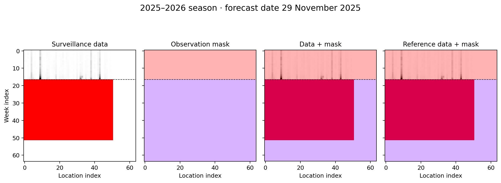
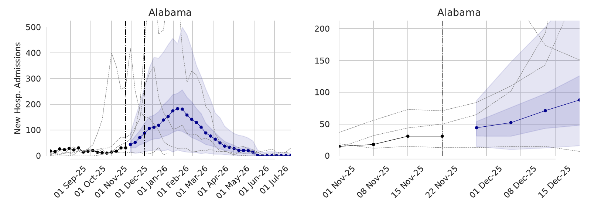

# 9. Generate operational forecasts

The objective is to produce a forecast for the current influenza season using a trained model and the latest reported hospitalizations. Each forecasting cycle starts by updating surveillance data, then uses `run_operational_flusight.py` to inspect the observations, condition the model, and export FluSight CSVs, forecast PDFs, and sampled trajectories.

Reuse the selected checkpoint and its training dataset from the earlier steps. The observations and forecast date change each week; you can run this workflow without retraining. The figures below illustrate a reference date of **November 29, 2025**; set the date for your own forecast before sampling.

## 1. Update the surveillance data first

Before opening or running the forecasting notebook for a new forecast, update the local data checkouts from the research repository root:

```bash
bash update-data.sh
```

The script pulls the local FluSight, NC collaboration, and Metrocast repositories listed in [environment setup](../getting-started/installation.md#source-repositories). Run it each time you prepare a new operational forecast, before the notebook constructs its ground-truth object.

`GroundTruth.for_flusight` reads local hospitalization data; it does not download the latest observations. For the 2025–2026 example, the current reader uses `Flusight/2024-2025/FluSight-forecast-hub-official/target-data/target-hospital-admissions.csv`. The directory name does not limit the seasons in that file. The notebook uses `nogit=True`, so setting `data_date` alone neither refreshes the data nor selects a historical Git revision.

## 2. Open the notebook

Complete [environment setup](../getting-started/installation.md) and make the selected checkpoint and its [training dataset](build-training-datasets.md) available. Run from the research repository root. Open `run_operational_flusight.py` as a Jupytext notebook in your editor, or create an unexecuted notebook copy:

```bash
jupytext --to notebook run_operational_flusight.py --output run_operational_flusight.ipynb
jupyter lab run_operational_flusight.ipynb
```

Select **Python (diffusion_torch)** as the kernel. Run the cells interactively, setting the configuration before loading the model or starting sampling.

## 3. Choose the model and forecast date

The notebook uses scenario **868**, **512 samples**, and CoPaint configuration **`celebahq_noTTJ5`**. Set `forecast_date` to the intended forecast reference date; the checked-in notebook contains a fixed example date that must be changed for a new run.

To use the i868 candidate trained in the example experiment from step 3, set the configuration cell to:

```python
scenario_id = 868
forecast_date = "2025-11-29"  # Replace with your forecast reference date.
config_name = "celebahq_noTTJ5"
batch_size = 512
experiment_name = "my-flu-experiment_training"
run_id = None
model_path = None
```

The notebook finds a finished run for that scenario in the named MLflow experiment. Use your selected scenario and experiment name. To select a particular training execution, set `experiment_name = None` and `run_id` to its MLflow run ID. To load a checkpoint file directly, set both `experiment_name` and `run_id` to `None` and set `model_path` to the `.pth` file.

The model/dataset cell also loads the scenario's training data to construct its transformations. Check that `dataset_library()` still points to the dataset used to train your checkpoint, and inspect the printed scenario string before sampling.

## 4. Inspect the observations and mask

[](../assets/operational/2025-11-29-observation-mask.png)

**Early-season observation mask.** This recreates the notebook's first graph, `gt1.plot_mask()`, using a surveillance snapshot from November 26, 2025, with observations through November 22. Rows are weeks and columns are locations on the padded 64 × 64 image grid. The mask is 1 for observed history and 0 for future weeks; its upper band is pink and its lower band is purple. The dashed line marks the forecasting boundary. Red entries in the data panels are missing values, while the extra rows and columns are padding. The last two panels overlay the same mask on the data and reference data; both use the same archived snapshot here, as in the notebook's `nogit=True` workflow.

Unlike [the reconstruction experiments](mask-experiments.md), the operational mask leaves the observed history available and hides the future. Inspect this graph before sampling to confirm the season, available observations, and forecast boundary.

Run the ground-truth cells after configuring the date. Confirm that the mask ends at the intended observation boundary and that the data panels contain the latest reported weeks. With `nogit=True`, this is the local surveillance snapshot you refreshed before opening the notebook.

## 5. Run inpainting

Run the sampler cells. They transform the observations, pass the data and mask to `O_DDIMSampler`, generate 512 trajectories, and transform the results back to hospitalization counts. The notebook then plots national and state forecasts. Review their agreement with recent observations and the spread of possible future trajectories before exporting.

## 6. Review the forecast plots

[](../assets/operational/2025-11-29-forecast-50-95.pdf)

**Saved operational forecast for Alabama, November 29, 2025.** This is an excerpt from the original `plot50-95.pdf` in `Flusight`, showing the full season at left and the forecast window at right. Blue curves show medians and shaded bands show the 50% and 95% prediction intervals. Black points show available observations, gray dashed curves show earlier seasons, and vertical lines mark the forecast boundary and horizon in the full-season view.

[Open the full original forecast PDF, including national and state panels](../assets/operational/2025-11-29-forecast-50-95.pdf)

## 7. Export the forecast

The export cells choose the next Saturday from the current date as `submission_date`, refresh the ground-truth object from the local data, and write to `operational_output/<submission_date>/`. For a live run, keep the sampling date, observations, and submission reference date consistent. To replay a historical example, use its archived surveillance snapshot and explicitly set the export date and ground-truth cutoff to match; the default export cells use today's date even if `forecast_date` is historical.

With the notebook's default prefix `UNC_IDD-InfluPaint`, the outputs are:

| Output | Contents |
| --- | --- |
| `<date>-UNC_IDD-InfluPaint.csv` | Location and national quantiles for the FluSight targets |
| `UNC_IDD-InfluPaint-<date>-plot50-95.pdf` | Median forecasts with 50% and 95% intervals |
| `UNC_IDD-InfluPaint-<date>-plotall.pdf` | Median forecasts with the full set of quantile bands |
| `<date>_fluforecasts_raw.npy` | Samples on the transformed model scale |
| `<date>_fluforecasts_transformed_inv.npy` | Sampled trajectories on the hospitalization scale |
| `<date>_forecasts_national.npy` | National trajectories aggregated from the samples |

The array files are written when `save_raw_arrays=True`. Review the plots and exported dates before using the CSV as a submission. Running the notebook creates local files; submission to FluSight is a separate action.

??? tip "Inspect a saved operational forecast"

    To use the paper's selected checkpoint, set `scenario_id = 868`, `experiment_name = None`, `run_id = None`, and `model_path = "influpaint-paper/influpaint_paper_reproduction_data/i868::m_U500cRx1224::ds_30S70M::tr_Sqrt::ri_No::3000.pth"`. Use its July 17 training dataset as described in step 2.

    The example report and its preview are included on this page, so no model run is needed to inspect them. The original November 29 files are under `Flusight/2025-2026/Flusight 2025-2026/2025-11-29/` in the local research archive. These are separate from the paper reproduction archive's earlier operational submissions in `forecasts/operational/`.

??? info "Sources for the example figures"

    The mask uses `target-data/target-hospital-admissions.csv` from revision `aa25b8d92c06241d7e50dfb15b80fbc04f6483d5` in the local `Flusight/2024-2025/my-hub-fork-for-submissions` checkout. It is reconstructed from that archived surveillance snapshot, not extracted from a saved notebook output. The PDF is copied unchanged from `Flusight/2025-2026/Flusight 2025-2026/2025-11-29/UNC_IDD-InfluPaint_celebahq_noTTJ5-2025-11-29-plot50-95.pdf`; the inline preview crops its Alabama row.

    Regenerate these documentation assets from the local source files with:

    ```bash
    python -m main_training.render_operational_story
    ```

    This calls the notebook's mask plotting method and uses Poppler's `pdftoppm` for the PDF preview. It does not generate new forecasts.

[Previous: 8. Reproduce the paper figures](paper-figures.md) · [Back to contents](start-here.md)
